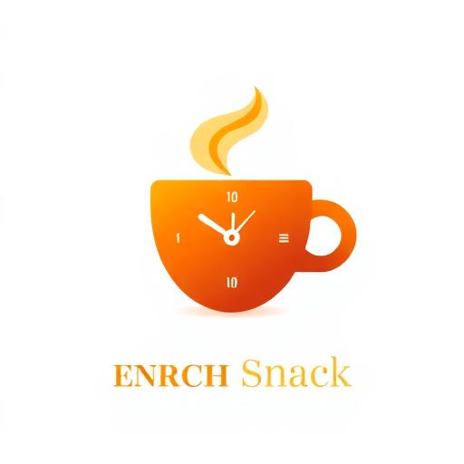

# 🍵 Dream Snack - Homemade Food Delivery Service

<div align="center">
  
  
  ### Fresh Homemade Food in Just 10 Minutes!
  
  [](https://dreamsnack.com)
  [](https://dreamsnack.com)
  [](https://dreamsnack.com)
  [](https://dreamsnack.com)
</div>

---

## 🌟 About Dream Snack

Dream Snack is a revolutionary homemade food delivery service that brings authentic, non-chemical tea, coffee, and snacks right to your doorstep in just **10 minutes**. Founded by **Devansh & Shrey**, we pride ourselves on delivering fresh, homemade quality that reminds you of home.

### 💚 Our Promise: Homemade means Non-Chemical

Every product is crafted with love in our home kitchen using only natural ingredients - no preservatives, no chemicals, just pure homemade goodness.

---

## 🚀 Features

- ⚡ **Lightning Fast Delivery**: 10-minute delivery guarantee
- 🏠 **100% Homemade**: Prepared fresh in our home kitchen
- 🌿 **Non-Chemical**: No preservatives or artificial ingredients
- 📱 **Easy Ordering**: Simple and intuitive web interface
- 💰 **Affordable Prices**: Starting from just ₹15
- 🕐 **Extended Hours**: 6:00 AM to 9:00 PM service
- 📅 **Daily Service**: Open 7 days a week

---

## 🍽️ Our Menu

### ☕ Beverages
- **Homemade Tea** - ₹15
  - Freshly brewed with premium tea leaves
  - Traditional Indian preparation
  
- **Fresh Coffee** - ₹20
  - Rich aromatic blend
  - Made from quality coffee beans

### 🍿 Snacks
- **Sweet Corn** - ₹50
  - Perfectly seasoned
  - Fresh and crunchy
  
- **Mixed Snacks Combo** - ₹50
  - Variety of homemade snacks
  - Perfect for sharing

---

## 📍 Delivery Areas

We currently serve the following areas with our 10-minute delivery promise:

- 🏘️ **Kamla Nagar**
- 🏘️ **Balkeshwar**
- 🏘️ **Adarsh Nagar**
- 🏘️ **Karmyogi**

*More areas coming soon!*

---

## 🕐 Service Information

| Service | Details |
|---------|---------|
| **Operating Hours** | 6:00 AM - 9:00 PM |
| **Days** | Monday to Sunday (7 Days) |
| **Delivery Time** | 10 Minutes Guaranteed |
| **Delivery Fee** | FREE |
| **Minimum Order** | No Minimum |

---

## 👥 Meet the Founders

**Devansh & Shrey** - Two passionate food enthusiasts who believe in bringing the authentic taste of homemade food to your doorstep. Our mission is to provide healthy, chemical-free alternatives to conventional fast food.

---

## 📞 Contact Information

- **Phone**: [+91 9412104618](tel:+919412104618)
- **Email**: [sanjayvansu1973@gmail.com](mailto:sanjayvansu1973@gmail.com)
- **Website**: [Dream Snack](https://dreamsnack.com)
- **About Us**: [vanshubhai.vercel.app](https://vanshubhai.vercel.app)

---

## 💻 Technology Stack

This website is built with modern web technologies for optimal performance:

- **Frontend**: React + TypeScript
- **Styling**: Tailwind CSS
- **Build Tool**: Vite
- **UI Components**: Shadcn/ui
- **Icons**: Lucide React
- **SEO**: Fully optimized with meta tags and structured data

---

## 🎯 Our Values

1. **Quality First**: We never compromise on the quality of ingredients
2. **Health Conscious**: 100% Non-Chemical, preservative-free food
3. **Customer Satisfaction**: Your happiness is our priority
4. **Punctuality**: 10-minute delivery or we make it right
5. **Transparency**: What you see is what you get

---

## 🚀 Getting Started (For Developers)

### Prerequisites
- Node.js (v18 or higher)
- npm or yarn

### Installation

```bash
# Clone the repository
git clone https://github.com/yourusername/dream-snack.git

# Navigate to project directory
cd dream-snack

# Install dependencies
npm install

# Start development server
npm run dev

# Build for production
npm run build
```

### Project Structure

```
dream-snack/
├── src/
│   ├── assets/         # Images and static files
│   ├── components/     # React components
│   │   ├── ui/        # Reusable UI components
│   │   └── ...        # Feature components
│   ├── pages/         # Page components
│   └── main.tsx       # Application entry point
├── public/            # Public assets
├── index.html         # HTML template
└── README.md          # Project documentation
```

---

## 🌟 Why Choose Dream Snack?

### For Customers
- ✅ Fastest delivery in town (10 minutes)
- ✅ Homemade quality you can trust
- ✅ Affordable prices
- ✅ No chemicals or preservatives
- ✅ Fresh preparation for every order

### For the Community
- 🤝 Supporting local business
- 🌱 Promoting healthy eating habits
- 💚 Environmentally conscious packaging
- 👨‍👩‍👧‍👦 Family-friendly service

---

## 📈 Future Plans

- 🆕 Expanding delivery areas
- 🍽️ Adding more homemade delicacies
- 📱 Mobile app development
- 🎁 Loyalty program for regular customers
- 🌍 Sustainable packaging initiatives

---

## 🏆 Achievements

- 🌟 100% Customer Satisfaction Rate
- ⚡ Average Delivery Time: Under 10 Minutes
- 💯 Zero Chemical Policy Maintained
- 🎯 Serving 4+ Areas Successfully

---

## 📜 License

© 2024 Dream Snack. All rights reserved.

Created with ❤️ by **Devansh & Shrey**

---

<div align="center">
  
  ### 🍵 Dream Snack - Where Every Bite Feels Like Home! 🍵
  
  **Homemade means Non-Chemical**
  
  [Order Now](https://dreamsnack.com) | [About Us](https://vanshubhai.vercel.app)
  
</div>